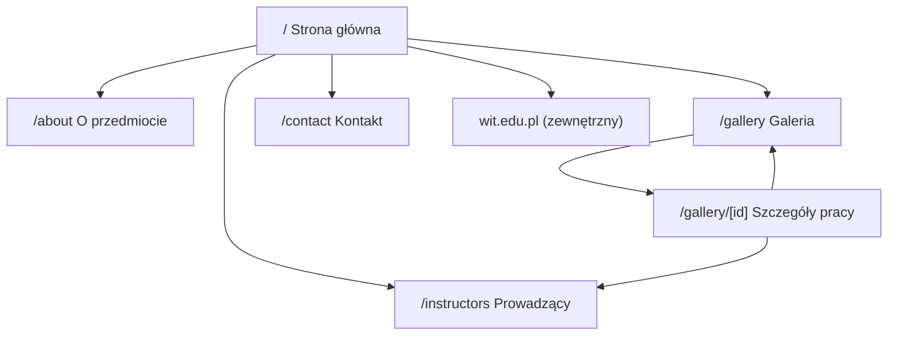

# Architektura informacji

## Mapa serwisu

## Nawigacja główna

Strona główna · O przedmiocie · Galeria · Prowadzący · Kontakt — przyklejony `Navbar`, powtórzenie w `Footer`.

## Kategoryzacja

- **Semestr:** Wszystkie, 1, 2, 3 (filtr po stronie klienta)
- **Technika:** Wszystkie, Olej, Akwarela, Akryl, Gwasz, Tempera, Technika mieszana

## Logika filtrowania

`filterWorks()` w `src/lib/utils.ts` stosuje logikę AND dla semestru i techniki bez przeładowania strony. `GalleryFilters` aktualizuje stan React; `GalleryGrid` renderuje ponownie z `AnimatePresence`.

## Pola wpisu pracy

Zgodne z typem `Work`: `id`, `title`, `author`, `academicYear`, `semester`, `technique`, `dimensions`, `description`, `thumbnailSrc`, `fullSrc`, `instructorId`, `featured`. Typ `Semester` dopuszcza wartości 1–6; filtry w UI obejmują semestry 1–3 zgodnie z danymi demonstracyjnymi.

## Struktura URL

| URL             | Strona          | Cel                                               |
| --------------- | --------------- | ------------------------------------------------- |
| `/`             | Strona główna   | Wejście, wyróżnione prace, CTA                    |
| `/about`        | O przedmiocie   | Opis przedmiotu (FAQ w Accordion)                 |
| `/gallery`      | Galeria         | Siatka z filtrami + modal                         |
| `/gallery/[id]` | Szczegóły pracy | Pełny widok do udostępnienia, karuzela, prev/next |
| `/instructors`  | Prowadzący      | Profile wykładowców                               |
| `/contact`      | Kontakt         | Informacje o programie i przekazywaniu prac       |
