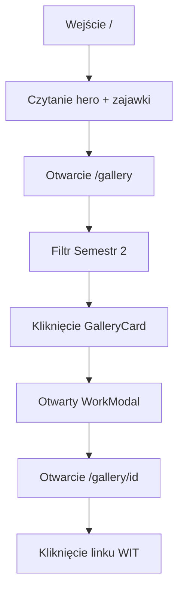
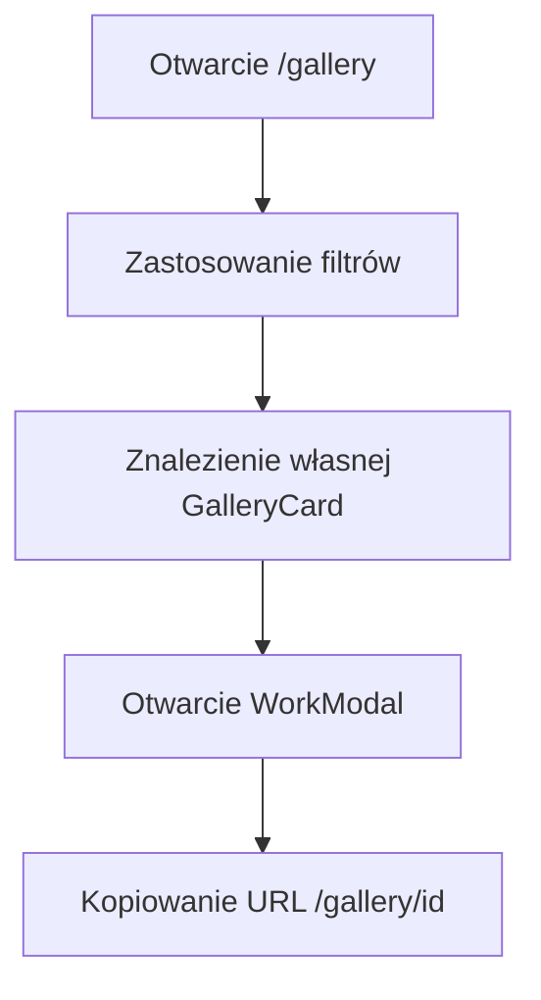
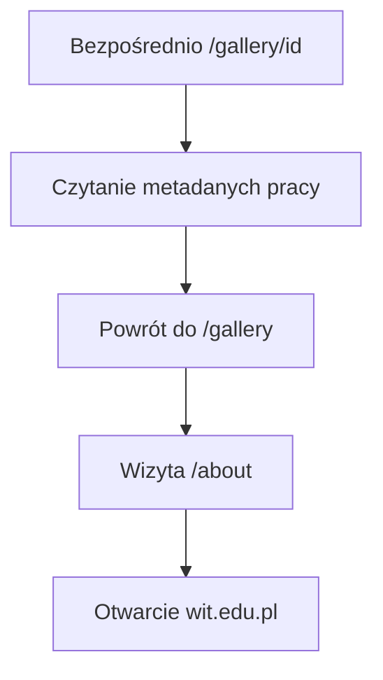

# Ścieżki użytkownika

## Ścieżka 1 — Kandydat przegląda obrazy

Odwiedzający trafia na stronę główną, czyta zajawkę o przedmiocie, otwiera galerię, filtruje Semestr 2, otwiera pracę w `WorkModal`, przechodzi na stronę szczegółów, następnie klika logo WIT i przechodzi na wit.edu.pl.

## Ścieżka 2 — Student znajduje własną pracę

Student otwiera galerię, filtruje po technice lub semestrze, lokalizuje swoją kartę, otwiera modal i kopiuje URL `/gallery/[id]` do udostępnienia.

## Ścieżka 3 — Gość zewnętrzny przez bezpośredni link

Odwiedzający trafia na `/gallery/[id]` z mediów społecznościowych, czyta metadane, przegląda całą galerię, odwiedza O przedmiocie, następnie wit.edu.pl.

