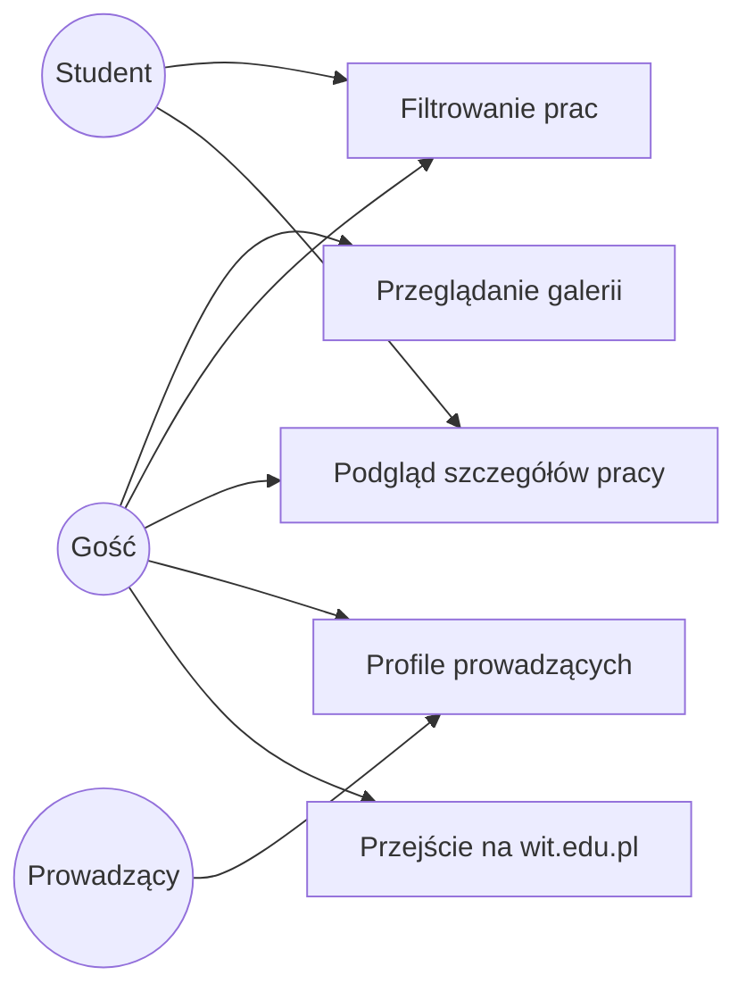
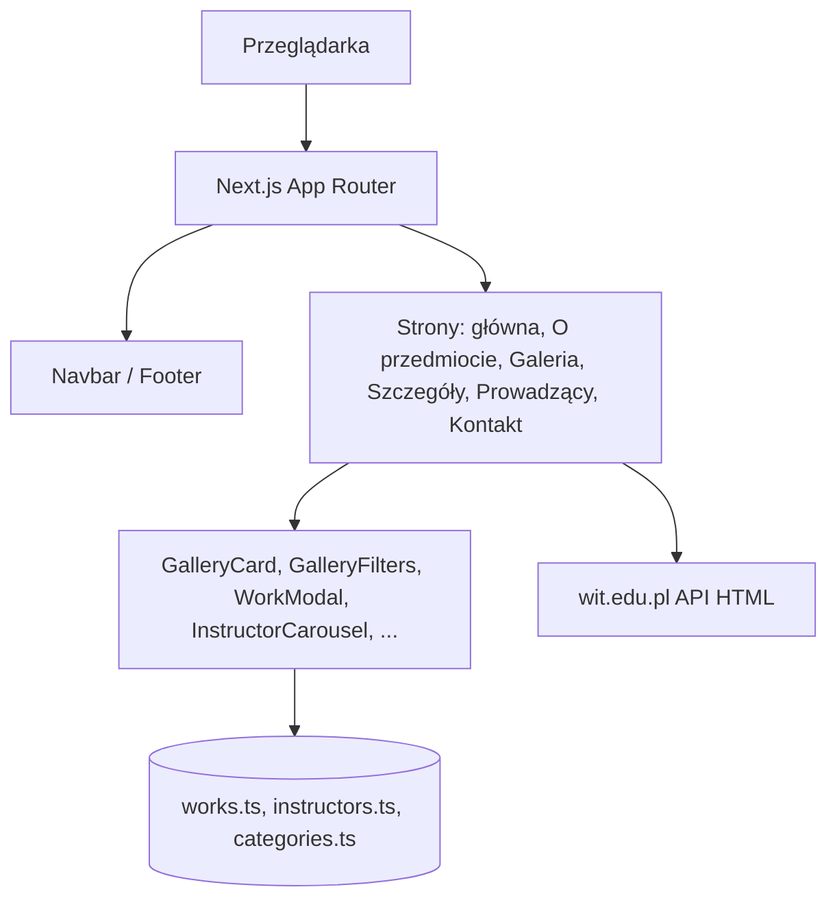
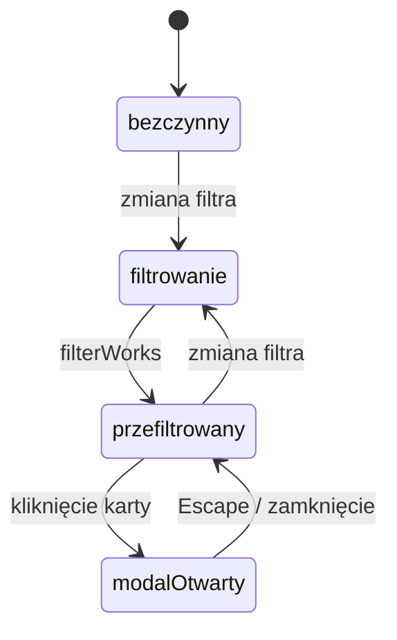

# Diagramy UML

## Diagram przypadków użycia



## Diagram komponentów



## Model danych

```
┌─────────────┐       ┌─────────────┐
│   Author    │       │ Instructor  │
├─────────────┤       ├─────────────┤
│ firstName   │       │ id          │
│ lastName    │       │ firstName   │
└──────┬──────┘       │ lastName    │
       │              │ title       │
       │ zagnieżdżony │ photoSrc    │
       ▼              │ bio         │
┌─────────────┐       │ specialisation
│    Work     │       │ websiteUrl? │
├─────────────┤       └──────▲──────┘
│ id          │              │
│ title       │   instructorId│
│ semester    │───────────────┘
│ technique   │
│ thumbnailSrc│
│ fullSrc     │
└─────────────┘
```

## Diagram stanów galerii


